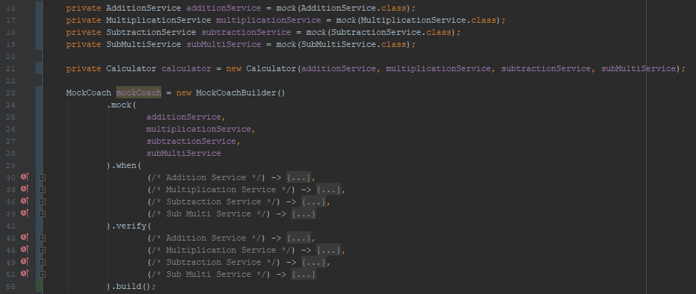
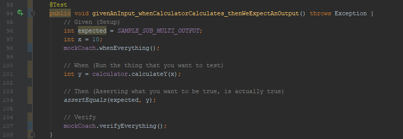
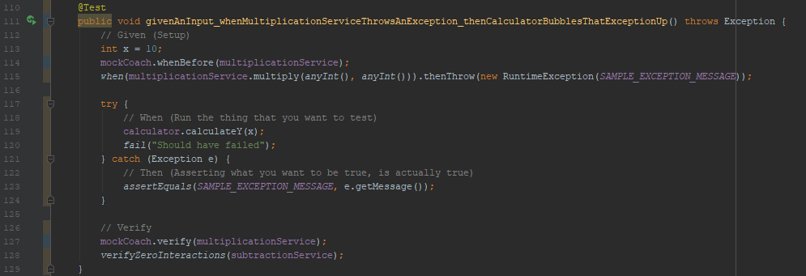

# Mock Coach

The Java library used to implement the Mock Coach design pattern. Used in tests to reduce complex logic and boilerplate code in overall codebase.

Note: For testing methods, Mock Coach helps enforce Service [Dipath](https://en.wiktionary.org/wiki/directed_path) Chain, over Service Cyclic Graphs (SCG). If the method you are testing happens to be an SCG, you can do the following:

1. Separate and/or move the service calls into multiple methods within a facade. Call the facade's methods within the current method to achieve same functionality.
2. Keep the cyclic graph, and perform your mocks/when/verifies without Mock Coach. Encouraged for smaller cyclic graphs and cycles, where splitting the code can cause more confusion. 

Service Dipath Chains are recommended in most cases over Service Cyclic Graphs, because it is faster to understand and work with code when services are used in order one-by-one compared to when service usage is intertwined (both in business logic and in tests).

### How to Install

This library will eventually be added to Maven Central. In the mean time, follow these steps to use Mock Coach:

1. Create MockCoach and MockCoachBuilder classes within your test folder. Create MockCoachRunnable interface within your test folder.
2. Copy the class and interface code from this Git repository to the corresponding files created in Step 1.
3. Fix any compile errors

## Example Usages

### Creating MockCoach



```
private AdditionService additionService = mock(AdditionService.class);
private MultiplicationService multiplicationService = mock(MultiplicationService.class);
private SubtractionService subtractionService = mock(SubtractionService.class);
private SubMultiService subMultiService = mock(SubMultiService.class);

private Calculator calculator = new Calculator(additionService, multiplicationService, subtractionService, subMultiService);

MockCoach mockCoach = new MockCoachBuilder()
        .mock(
                additionService,
                multiplicationService,
                subtractionService,
                subMultiService
        ).when(
                (/* Addition Service */) -> {
                    when(additionService.add(anyInt(), anyInt())).thenReturn(SAMPLE_ADDITION_OUTPUT);
                },
                (/* Multiplication Service */) -> {
                    when(multiplicationService.multiply(anyInt(), anyInt())).thenReturn(SAMPLE_MULTIPLICATION_OUTPUT);
                },
                (/* Subtraction Service */) -> {
                    when(subtractionService.subtract(anyInt(), anyInt())).thenReturn(SAMPLE_SUBTRACTION_OUTPUT);
                },
                (/* Sub Multi Service */) -> {
                    when(subMultiService.subtractThenMultiplyBy2(anyInt(), anyInt())).thenReturn(SAMPLE_SUB_MULTI_OUTPUT);
                }
        ).verify(
                (/* Addition Service */) -> {
                    verify(additionService, times(1)).add(anyInt(), anyInt());
                },
                (/* Multiplication Service */) -> {
                    verify(multiplicationService, times(1)).multiply(anyInt(), anyInt());
                },
                (/* Subtraction Service */) -> {
                    verifyZeroInteractions(subtractionService);
                },
                (/* Sub Multi Service */) -> {
                    verify(subMultiService, times(1)).subtractThenMultiplyBy2(anyInt(), anyInt());
                }
        ).build();
```

### Unit Testing - Success Case

```
    @Test
    public void givenAnInput_whenCalculatorCalculates_thenWeExpectAnOutput() throws Exception {
        // Given (Setup)
        int expected = SAMPLE_SUB_MULTI_OUTPUT;
        int x = 10;
        mockCoach.whenEverything();

        // When (Run the thing that you want to test)
        int y = calculator.calculateY(x);

        // Then (Asserting what you want to be true, is actually true)
        assertEquals(expected, y);

        // Verify
        mockCoach.verifyEverything();
    }
```

### Unit Testing - Exception and Other Cases

```
    @Test
    public void givenAnInput_whenMultiplicationServiceThrowsAnException_thenCalculatorBubblesThatExceptionUp() throws Exception {
        // Given (Setup)
        int x = 10;
        mockCoach.whenBefore(multiplicationService);
        when(multiplicationService.multiply(anyInt(), anyInt())).thenThrow(new RuntimeException(SAMPLE_EXCEPTION_MESSAGE));

        try {
            // When (Run the thing that you want to test)
            calculator.calculateY(x);
            fail("Should have failed");
        } catch (Exception e) {
            // Then (Asserting what you want to be true, is actually true)
            assertEquals(SAMPLE_EXCEPTION_MESSAGE, e.getMessage());
        }

        // Verify
        mockCoach.verify(multiplicationService);
        verifyZeroInteractions(subtractionService);
    }
```
